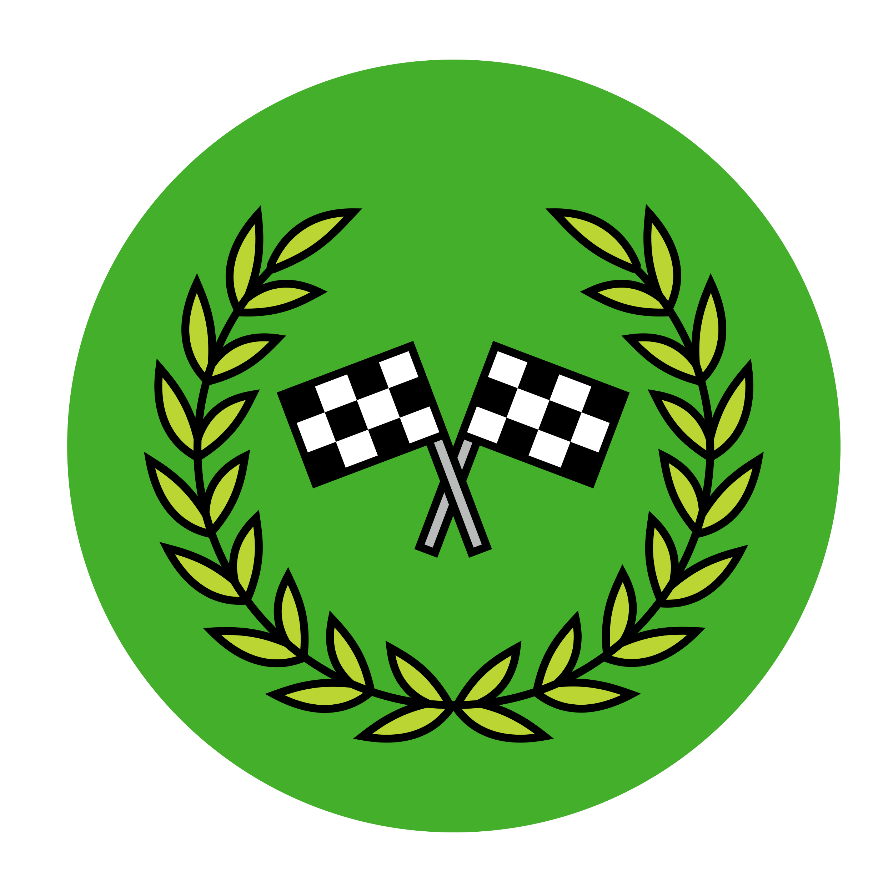

# Winners Circle
*Reinforcement Learning (RL) Workshop*

Welcome Victors! The Technology Guild Program will reinforce your winning habits and competitive spirt with day of fun and a focus on cutting edge artificial intelligence techniques. We will introduce reinforcement learning (RL), teach algorithms to beat classic video games, and play with self-driving cars. This workshop is your time to tinker.

### Agenda

 *4/11* | Thursday
 -- | --
12:00 - 12:45 | Welcome Address & Lunch
12:45 - 1:45 | Introduction to Reinforcement Learning with Paperspace GPUs
1:45 - 2:45 | Deep-Q Learning (DQN) with Atari SpaceInvaders
2:45 - 3:45 | Genetic Algorithms in the Gym
3:45 - 4:00 | :coffee: Break
4:00 - 6:00  | AWS DeepRacer Demo
6:00 - 6:30 | Break / Travel Time
6:30 - 8:30 | Dinner @ Steakhouse

*4/12* | Fridayde3 43211v   
-- | --
8:30 - 9:00 | Breakfast
9:00 - 10:30 | Step-up Super Mario Brothers RL Algorithm
10:30 - 11:00 | Break
11:00 - 12:30 | Lunch & Super Mario Competition Livestream
12:30 - 1 | Closing Thoughts & Winner Announcements

--------------
### Paperspace
For the duration of this workshop, you will have access to a [Paperspace](https://www.paperspace.com/) account. You will need access to large scale processing power and GPUs to follow the workshop exercises in a timely manner. Please be cognizant of your usage. We will be actively monitoring usage during the event and reserve the right to kill any job or notebook.

We will be using Paperspace's Gradient Service and running notebooks from a Docker Image built for this event. The image is built from the base tensorflow-gpu image with some additional libraries (namely Gym). The image is automatically complied on DockerHub.

______________

### Special Thanks To

For hosting our DeepRacer Demo! Keep on the lookout for upcoming Machine Learning Guild Events with the DeepRacer.

